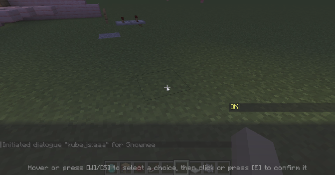
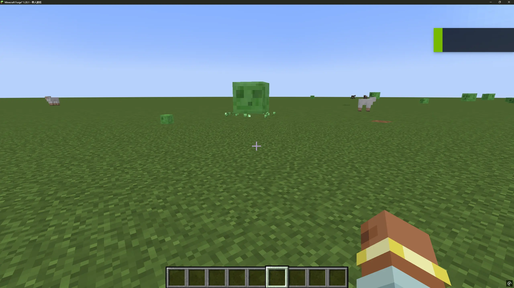

#  TextAnimator 效果总览教程

> 语法示例：
> `<effectName param1=value1 param2=value2>文字</effectName>`
> 效果可以**嵌套使用**，例如：
>
> ```text
> <typewriter><wiggle>TextAnimator</wiggle> is a mod by <wave><rainb>Snownee</rainb></wave>。
> ```
> 

---

## 🌀 1. `blur` 模糊效果

让文字产生柔和发散的模糊外观。

**参数：**

| 参数       | 类型    | 默认值  | 说明             |
| -------- | ----- | ---- | -------------- |
| `passes` | int   | 10   | 模糊采样次数（越高越平滑）  |
| `radius` | float | 2.0  | 模糊半径（像素单位）     |
| `alpha`  | float | 0.12 | 模糊层透明度（过低会不明显） |

**示例：**

```text
<blur passes=8 radius=2 alpha=0.15>Soft Text</blur>
```

---

## 🪩 2. `bounce` 弹跳效果

让文字垂直上下跳动，像呼吸或心跳一样。

**参数：**

| 参数      | 类型    | 默认值 | 说明           |
| ------- | ----- | --- | ------------ |
| `amp`   | float | 3.0 | 弹跳高度         |
| `speed` | float | 1.4 | 弹跳速度         |
| `phase` | float | 0.0 | 相位偏移，使相邻字符错开 |

**示例：**

```text
<bounce amp=4 speed=1.8>BOING!</bounce>
```

---

## 🌫 3. `fade` 透明闪烁

让文字透明度周期性变化，像呼吸灯。

**参数：**

| 参数      | 类型    | 默认值 | 说明         |
| ------- | ----- | --- | ---------- |
| `minA`  | float | 0.3 | 最小透明度（0～1） |
| `speed` | float | 1.0 | 变化速度       |
| `phase` | float | 0.0 | 每个字的相位偏移   |

**示例：**

```text
<fade minA=0.2 speed=1.5>Fading Text</fade>
```

---

## ⚡ 4. `glitch` 故障抖动

让文字产生电子屏幕抖动、闪烁和偏色的效果。

**参数：**

| 参数          | 类型    | 默认值 | 说明   |
| ----------- | ----- | --- | ---- |
| `intensity` | float | 1.0 | 效果强度 |
| `freq`      | float | 2.5 | 闪动频率 |
| `shift`     | float | 0.4 | 偏色几率 |
| `flicker`   | float | 0.1 | 闪烁几率 |

**示例：**

```text
<glitch intensity=1.2 shift=0.5 flicker=0.2>ERROR_404</glitch>
```

---

## 💓 5. `pulse` 颜色脉动

文字整体亮度随时间变化，模拟能量波动。

**参数：**

| 参数      | 类型    | 默认值  | 说明      |
| ------- | ----- | ---- | ------- |
| `base`  | float | 0.75 | 最小亮度倍率  |
| `amp`   | float | 0.25 | 亮度变化幅度  |
| `speed` | float | 1.0  | 变化速度    |
| `phase` | float | 0.0  | 字符间相位偏移 |

**示例：**

```text
<pulse base=0.6 amp=0.4 speed=1.5>Power Rising</pulse>
```

---

## 🌈 6. `rainb` 彩虹循环

不断变化的彩虹色彩。

**参数：**

| 参数 | 类型 | 默认值 | 说明  |
| -- | -- | --- | --- |
| —  | —  | —   | 无参数 |

**示例：**

```text
<rainb>Colorful Text!</rainb>
```

---

## 🕸 8. `pend` 钟摆旋转

文字绕小圆路径旋转

**参数：**

| 参数        | 类型    | 默认值  | 说明              |
| --------- | ----- | ---- | --------------- |
| `speed`   | float | 1.0  | 摆动速度           |
| `maxAngle`| float | 30.0 | 最大摆动角度（度）     |
| `radius`  | float | 1.5  | 圆周运动半径（像素）    |

**示例：**

```text
<pend speed="1.0" maxAngle="30" radius="2">
Mafuyu404 never like you
</pend>
```

---

## 🚀 8. `scroll` 横向滚动

让文字在水平方向持续滚动。

**参数：**

| 参数      | 类型    | 默认值 | 说明         |
| ------- | ----- | --- | ---------- |
| `speed` | float | 1.0 | 滚动速度（负值反向） |

**示例：**

```text
<scroll speed=0.8>News Ticker →</scroll>
```

---

## 🌑 9. `shadow` 阴影偏移

为文字绘制带偏移量的阴影层。

**参数：**

| 参数        | 类型    | 默认值 | 说明       |
| --------- | ----- | --- | -------- |
| `dx`      | float | 1.0 | 阴影水平偏移   |
| `dy`      | float | 1.0 | 阴影垂直偏移   |
| `r,g,b,a` | float | 0~1 | 阴影颜色与透明度 |

**示例：**

```text
<shadow dx=2 dy=2 r=0 g=0 b=0 a=0.6>Shadowed Text</shadow>
```

---

## 🚫 10. `shadow-off` 禁用阴影

禁止渲染原版文字的阴影层。

**示例：**

```text
<shadow-off>No Shadow</shadow-off>
```

---

## 💥 11. `shake` 抖动

文字在各方向小幅抖动，制造能量或紧张感。

**参数：**

| 参数 | 类型 | 默认值 | 说明  |
| -- | -- | --- | --- |
| —  | —  | —   | 无参数 |

**示例：**

```text
<shake>WARNING!</shake>
```

---

## 🌊 12. `swing` 水平摆动

让文字左右轻轻摆动，像吊牌晃动。

**参数：**

| 参数      | 类型    | 默认值 | 说明   |
| ------- | ----- | --- | ---- |
| `amp`   | float | 2.0 | 摆动幅度 |
| `speed` | float | 1.2 | 摆动速度 |
| `phase` | float | 0.0 | 相位偏移 |

**示例：**

```text
<swing amp=3 speed=1.8>Swing Text</swing>
```

---

## 🌬 13. `turbulence` 乱流晃动

产生随机的噪声扰动，文字如在风中。

**参数：**

| 参数      | 类型    | 默认值 | 说明   |
| ------- | ----- | --- | ---- |
| `amp`   | float | 1.5 | 扰动幅度 |
| `speed` | float | 1.0 | 扰动速度 |

**示例：**

```text
<turbulence amp=2 speed=1.5>Windy Text</turbulence>
```

---

## 🌊 14. `wave` 波浪起伏

让文字上下波动，如水波。

**参数：**

| 参数 | 类型 | 默认值 | 说明  |
| -- | -- | --- | --- |
| —  | —  | —   | 无参数 |

**示例：**

```text
<wave>Flowing Text</wave>
```

---

## 🐍 15. `wiggle` 抖摆

文字每个字符独立方向微摆动，带有方向感的波动。

**参数：**

| 参数 | 类型 | 默认值 | 说明  |
| -- | -- | --- | --- |
| —  | —  | —   | 无参数 |

**示例：**

```text
<wiggle>Wiggly Text!</wiggle>
```

## 🔄 7. `grad` 渐变

支持自定义起止颜色、方向（RGB/HSV）、速度与跨度的线性渐变。

**参数：**

| 参数      | 类型      | 默认值       | 说明                     |
| ------- | ------- | --------- | ---------------------- |
| `start` | 颜色(hex) | `#FFA033` | 起始颜色                 |
| `end`   | 颜色(hex) | `#33A0FF` | 结束颜色                 |
| `speed` | float   | `1.0`     | 动画流动速度（0 为静态）       |
| `span`  | float   | `30.0`    | 渐变周期跨度（影响字符密度）     |
| `hsv`   | boolean | `false`   | 是否在 HSV 空间插值（更自然过渡） |

**示例：**

```text
<grad start="#7FFFD4" end="#1E90FF" hsv="true" speed="0.3">
Mafuyu404 never like you
</grad>
```

参数预设：
```text
<glitch intensity="1.2" freq="3" shift="0.4" flicker="0.15">
  <fade minA="0.5" speed="1.3">
    <rainb>
      Mafuyu404 never like you
    </rainb>
  </fade>
</glitch>

<wave>
  <grad start="#7FFFD4" end="#1E90FF" hsv="true" speed="0.3">
    <bounce amp="2.5" speed="1.0">
      Mafuyu404 never like you
    </bounce>
  </grad>
</wave>

<blur passes="8" radius="2" alpha="0.18">
  <pulse base="0.8" amp="0.4" speed="2.5">
    <grad start="#FF0080" end="#00FFFF" hsv="false" speed="0.8">
      Mafuyu404 never like you
    </grad>
  </pulse>
</blur>

<turbulence amp="2" speed="2">
  <glitch intensity="1.3" freq="4" shift="0.5" flicker="0.25">
    <pulse base="0.7" amp="0.3" speed="2.2">
      Mafuyu404 never like you
    </pulse>
  </glitch>
</turbulence>

<pend speed="1.0" maxAngle="30" radius="2">
  <grad start="#FF69B4" end="#87CEFA" hsv="true" speed="0.5">
    <fade minA="0.4" speed="1.5">
      Mafuyu404 never like you
    </fade>
  </grad>
</pend>
```

预览：
> 